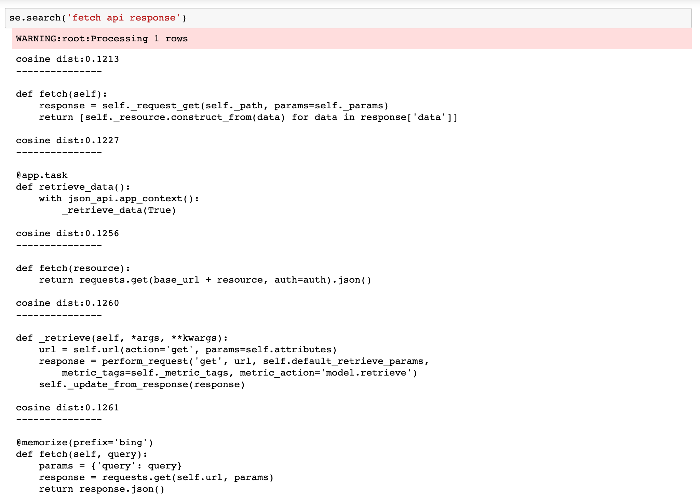

# Deep Semantic Code Search
Deep Semantic Code Search aims to explore a joint embedding space for code and description vectors and then use it for a code search application. 

In these experiments, there are 2 parts:

1. The first one uses an approach suggested in [1] and we train their architecture on our own python dataset.
2. The second approach expands on the first one through methodology suggested in [2] and we achieve reasonably good results.

We can observe that some sort of semantic information is captured the results:

 

### Instructions on reproducing our results

Implementation of [1] is within [Joint Training Model](pytorch_model) and [2] is within [Code Summarization Transfer Learning](code_summarization_transfer_learning)

### References:

[1] https://guxd.github.io/papers/deepcs.pdf

[2] https://towardsdatascience.com/semantic-code-search-3cd6d244a39c